<h2 align="center"> STUDENTS SCORES ANALYSIS AND PREDICTION </h2> 

  

# Table of contents
- [Introducción](#introducción)
- [Web Scraping](#web-scraping)
- [Students Performance Analysis](#students-performance-analysis)
- [Modelos de Machine Learning](#modelos-de-machine-learning)
- [Conclusiones](#conclusiones)

# Introducción
Este proyecto tiene como objetivo realizar un análisis integral utilizando dos enfoques: **Web Scraping** para extraer datos contextuales de una página web relevante y **Machine Learning** para predecir el rendimiento de los estudiantes en MATH SCORE.

Realicé un proceso de scraping en una web para extraer información contextual sobre el desempeño académico de estudiantes que también estuviera acorde con la información de mi dataset (genero, etnia, nivel educativo de los padres).

El dataset *Student Exam Scores* (Kaggle.com) contiene información sobre los estudiantes, como sus calificaciones en diferentes materias (Math, Reading y Writing), y factores que pueden influir en su desempeño (por ejemplo, el tiempo de estudio, el nivel educativo de los padres, el número de hermanos, si han hecho un test de preparación o no etc.). Así que utilizando este dataset, apliqué técnicas de preprocesamiento de datos y probé varios modelos de Machine Learning para predecir el rendimiento académico de los estudiantes en función de varias características.

# Web Scraping

El primer paso ha sido encontrar una web que me permitiera contextualizar el analisis de mi base de datos, es decir, si los resultados de math score (Math) y de writing y reading score (ERW) tenían algo que ver con variables como la etnia, el género y la educación de los padres de cada estudiante.

WEB: https://www.bestcolleges.com/research/average-sat-score-full-statistics/#demographics

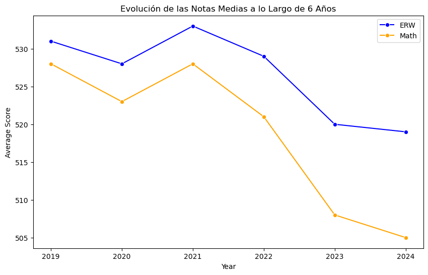

En 2024, la nota media de Math y Reading y Writing ha sido la más baja comparada con los 6 años previos.

2021 fue el año con la nota media más alta, tanto de Math como de Reading y Writing.

### **ETNIA**

  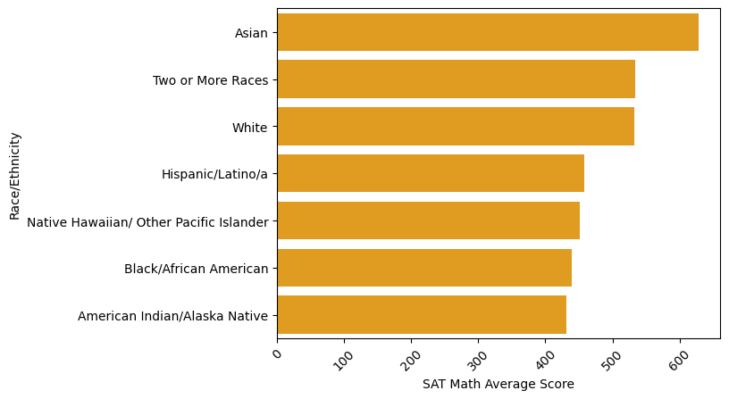
  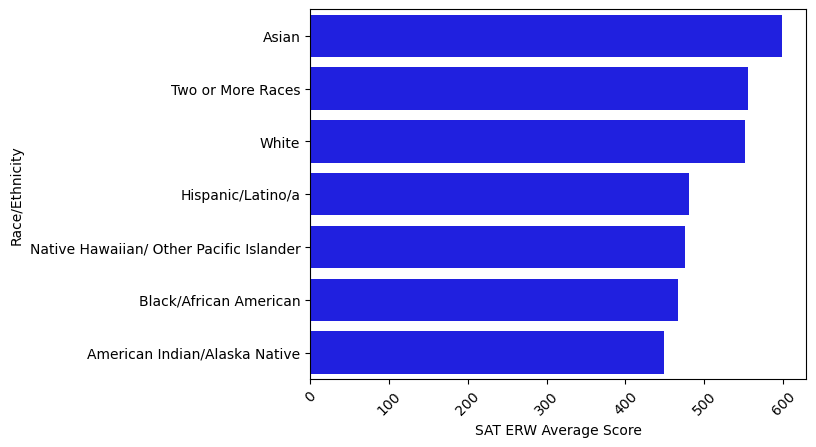

Los estudiantes **asiaticos** son los que mejores notas en promedio han sacado, seguidos por los **blancos** y los estudiantes de **2 o más etnias**

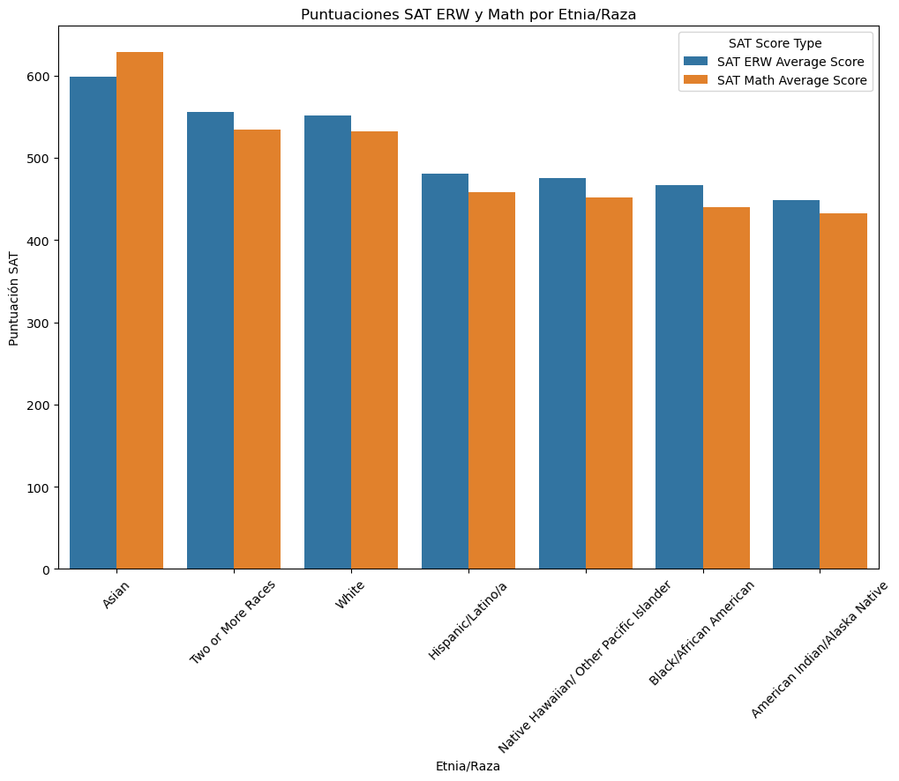

El último grupo está formado por estudiantes **American Indian/Nativos de Alaska**, el segundo grupo con puntuaciones más bajas está constituido por los **negros**.

### **GÉNERO**

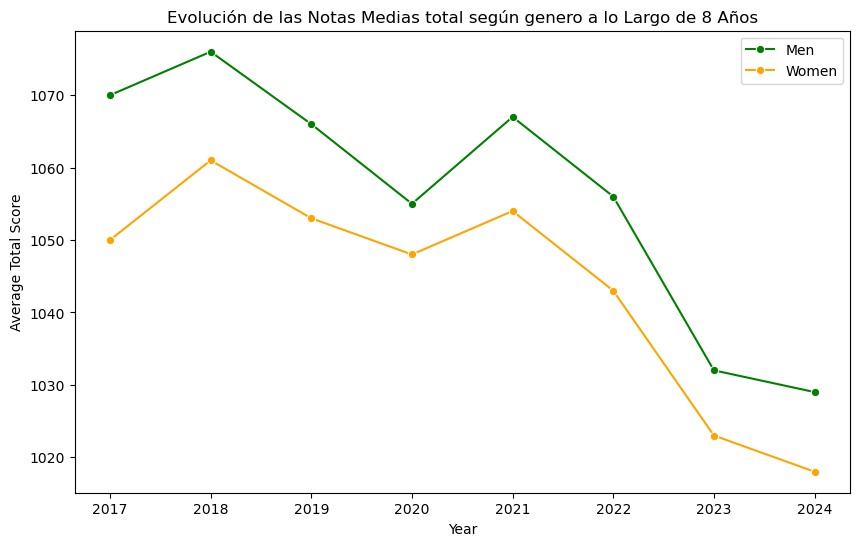

  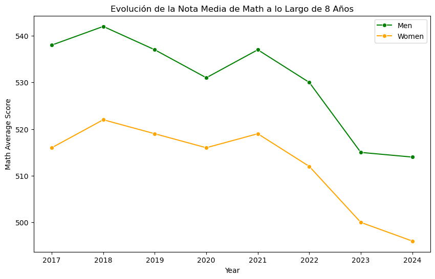
  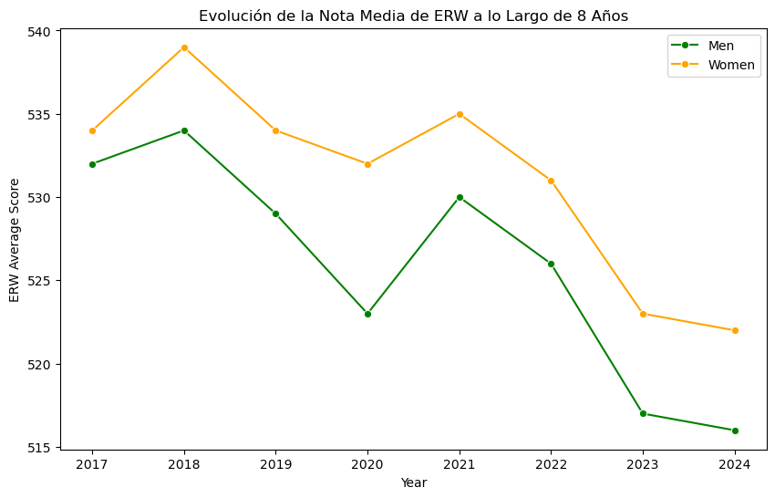

Observamos que en Math los hombres sacan mejor notas que las mujeres y en Reading y Writing pasa lo contrario.

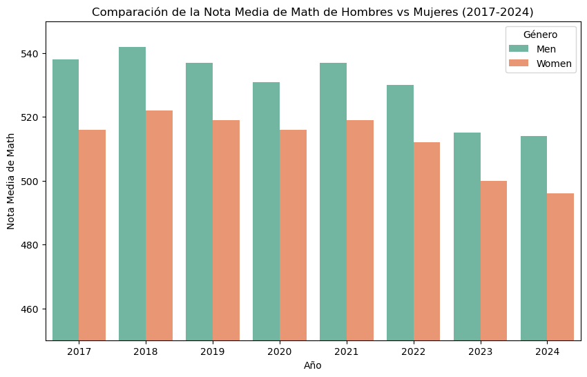

### **NIVEL EDUCATIVO DE LOS PADRES**

  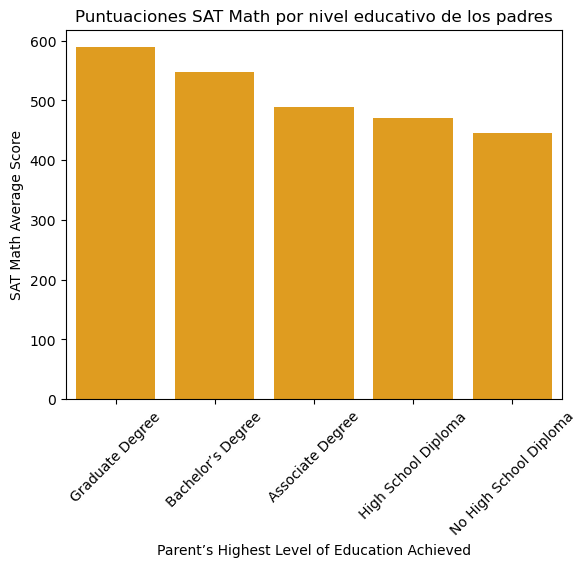
  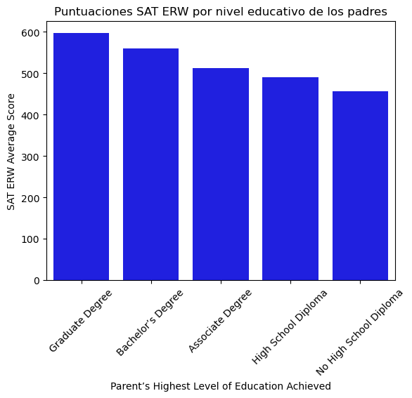

El nivel educativo de los padres parece influir en las notas tanto de Math como de ERW, concluyendo que a mayor nivel educativo más alta es la nota media.

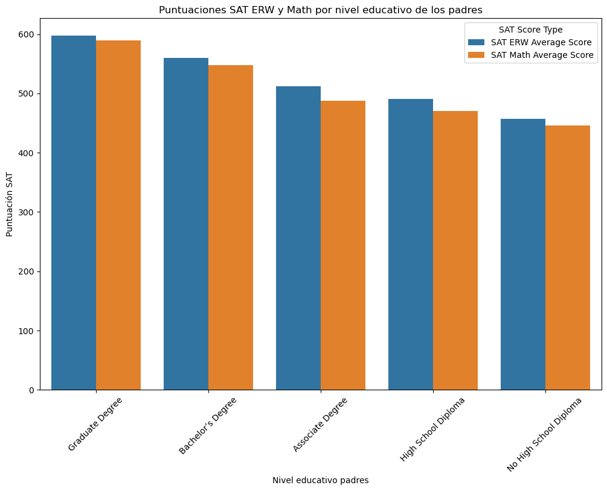

# Students Performance Analysis

El dataset se compone por un poco más de 30.000 observaciones y 14 columnas.

- Gender: género del estudiante (hombre/mujer)
- EthnicGroup: grupo etnico(A, B, C, D, E)
- ParentEduc: nivel de estudio de los padres(desde el highschool hasta el master's degree)
- LunchType: tipo de comida (standard o free/reduced)
- TestPrep: curso de preparación al test(completed or none)
- ParentMaritalStatus: parent(s) marital status (married/single/widowed/divorced)
- PracticeSport: con qué frecuencia el estudiante practica sport(never/sometimes/regularly)
- IsFirstChild: si es el primer hijo o no
- NrSiblings : número de hermanos que tiene el estudiante (0 a 7)
- TransportMeans: medio de transporte al colegio (schoolbus/private)
- WklyStudyHours: horas de estudio semanales (less than 5 hours, between 5 and 10 hours, more than 10 hours)
- MathScore: math test score (0-100), nuestra variable objetivo (Y)
- ReadingScore: reading test score (0-100)
- WritingScore writing test score (0-100)

### Diferenciación de Variables
Variables continuas VS variables categoricas

**Variables Continuas** (nr siblings, math score, reading score y writing score)

- Revisar duplicados.
- Checking null values: o cargarse las filas, reemplazar con media, intepolación. Solo estaban presentes en NrSiblings.

No me gustó ninguna opción, así que opté por asignar los nulos proporcionalmente a los valores que tengo, para no distorsionar la distribución.

- Dealing with outliers: he aplicado el interquartile method, quedandome con los valores mayores que el lower limit.

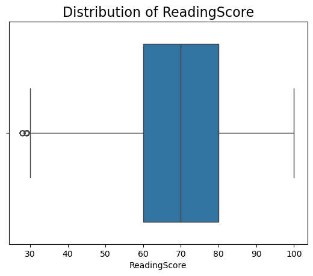
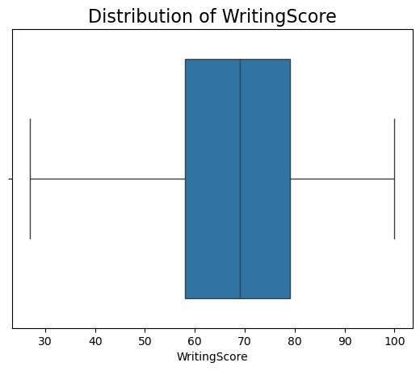

Intenté normalizar los datos con BOX-COX pero los valores se disparaban hasta llegar a 140, lo cual no tenía mucho sentido.

- Revisar Multicolinealidad

1. Scatterplot

  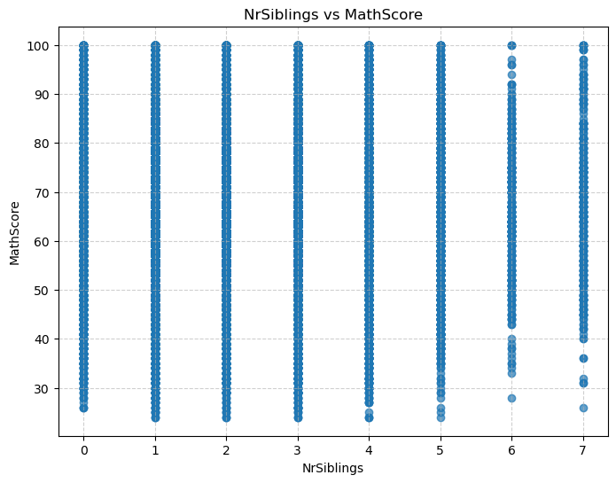
  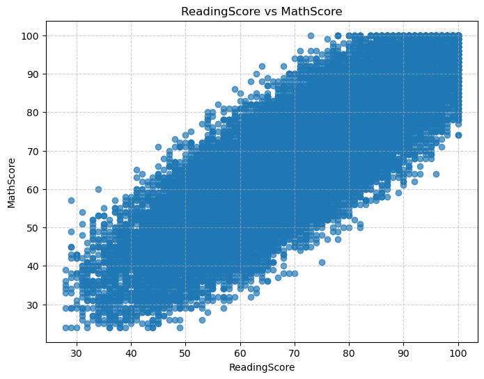
  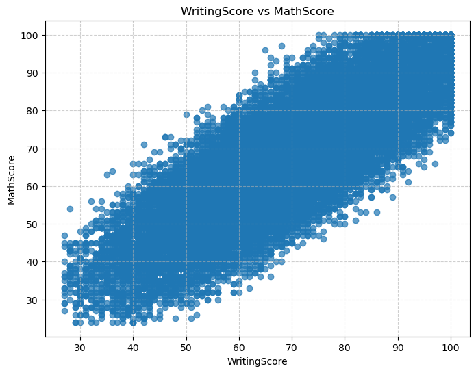

2. Heatmap

Vemos multicolinealidad (correlación muy alta) entre el readingscore y mathscore y el writing score y mathscore

3. VIF

Una técnica común para saber si hay multicolinealidad es revisar el VIF (Variance Inflation Factor) de las variables. Un VIF alto indica que una variable está altamente correlacionada con otras, lo que puede ser un signo de multicolinealidad. Generalmente, un VIF mayor que 10 es un indicio de que existe multicolinealidad significativa.

**Variables Categóricas**

- GENDER 

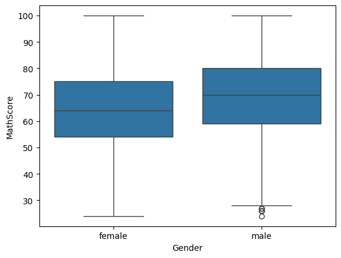

Los hombres tienen una nota media más alta (69,06) en comparación con la nota media de las mujeres (64,08).

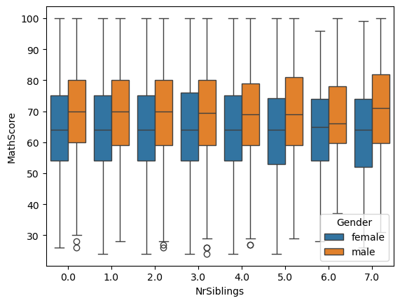

El hecho de tener hermanos parece no afectar al rendimiento.

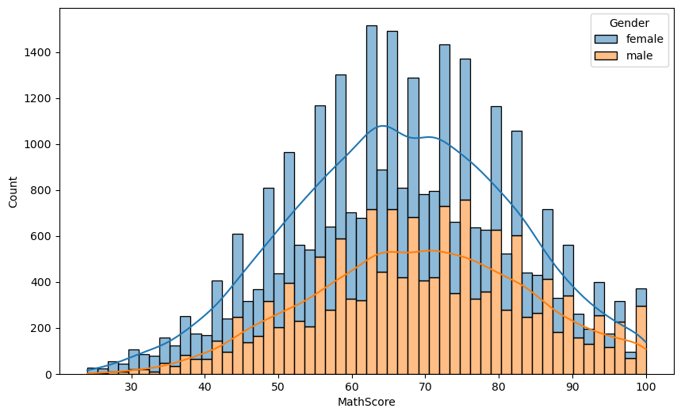

Los hombres suelen sacar notas más altas con respecto a las mujeres.

- ETHNIC GROUP 

Hay 5 grupos etnicos representados en el dataset.

A: Other ethnicity

B: Black/African American

C: White/Caucasian

D: Hispanic/latinos

E: Asians

El grupo C es el más representativo mientras que el grupo A el que menos. 
El hecho de pertenecer a un grupo o a otro afecta al rendimiento de los estudiantes. Podemos ver que el grupo E es con diferencia el que saca mejores notas, seguido por el grupo D.

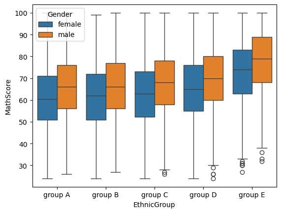

- PARENT EDUCATIONAL BACKGROUND

Existen 6 categorías de nivel educativo de los padres, que van desde master's degree (el nivel más alto) hasta bachillerato (high school).
Parece haber una correlación entre las puntuaciones y el nivel educativo de los padres. Los hijos de padres altamente educados obtienen mejores resultados que los hijos de padres con menos educación.

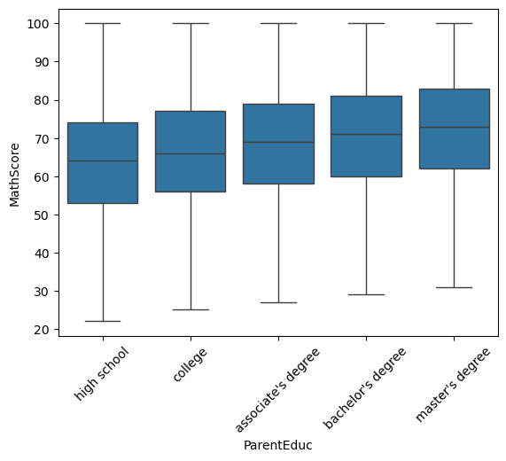

- LUNCH TYPE

Hay 2 tipos de comida que los estudiantes pueden tener en la escuela: almuerzo estandar o almuerzo reducido (gratis).

Standard: es el almuerzo regular que se proporciona a los estudiantes que no califican para el almuerzo gratuito o reducido. Los estudiantes con ingresos familiares más altos o aquellos que no cumplen con los criterios de elegibilidad para el programa de almuerzos gratuitos o reducidos reciben este tipo de almuerzo.

Reduced: este almuerzo es proporcionado a estudiantes que provienen de familias con bajos ingresos, generalmente en función de los criterios establecidos por el gobierno. El almuerzo es gratis o de bajo costo para los estudiantes que califican, según las pautas de ingresos del Departamento de Agricultura de los Estados Unidos (USDA)

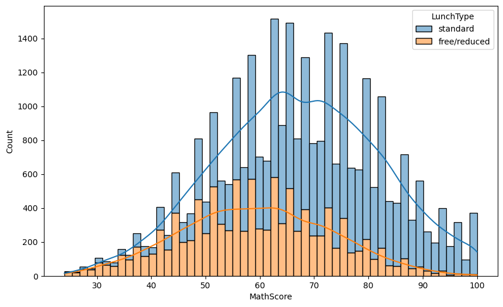

Casi el 65% de los estudiantes tiene la opción de desayuno estandard.
Parece que el tipo de comida tiene un efecto fundamental en las puntaciones de los tests.

Para comprobar si la variable LunchType depende significativamente por ejemplo de ParentEduc o del grupo etnico, realizamos el test de chi-cuadrado. 

Esto nos permite verificar si la distribución de LunchType entre los diferentes niveles de educación de los padres/etnias es aleatoria o si hay una dependencia significativa.

Valor p del test de chi-cuadrado parent educ: 0.431680941674747
Valor p del test de chi-cuadrado grupo etnico: 0.60314857775413

  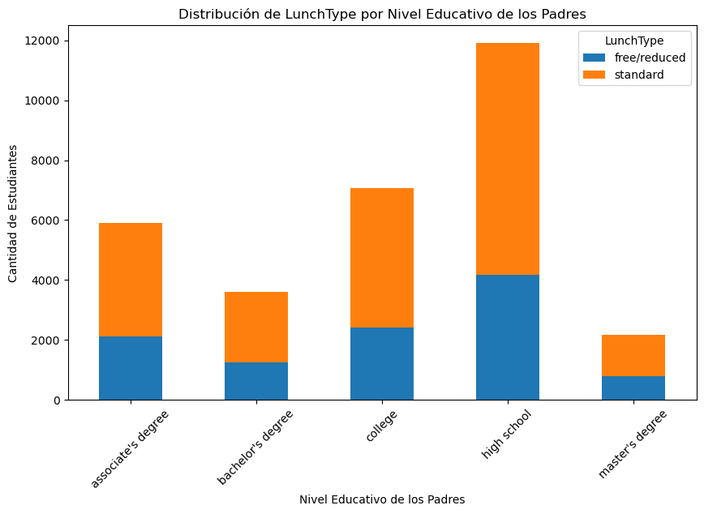
  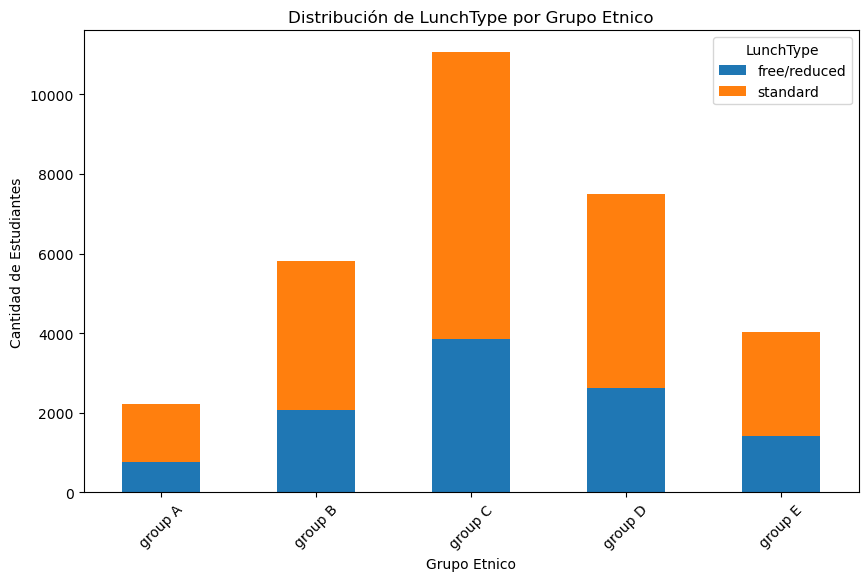

No hay una dependencia significativa entre el tipo de Lunch y la educación de los padres, tampoco con el grupo etnico.

- TEST PREP

1/3 de los estudiantes hicieron el prep test mientras que 2/3 no.
Esta feature tiene un efecto positivo en el rendimiento academico de los estudiantes.

Sin embargo vemos que esta variable no depende significativamente ni del Nivel educativo de los padres ni del grupo etnico.

Valor p del test de chi-cuadrado con ParentEduc: 0.6916627060921867

Valor p del test de chi-cuadrado con el grupo etnico: 0.23358418571007558

  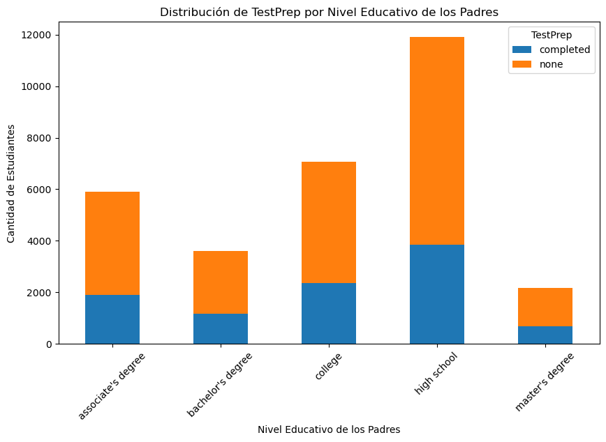
  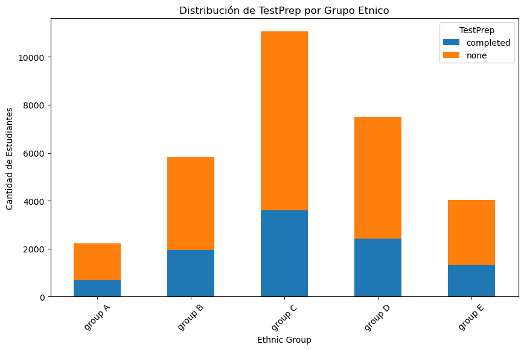

- PARENT MARITAL STATUS

Esta feature parece no tener correlación con las puntuaciones.

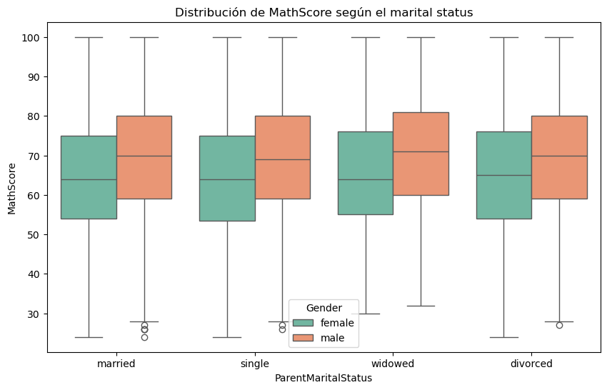

- PRACTICE SPORT

El hecho de practicar deporte podría afectar de manera positiva al rendimiento escolar.

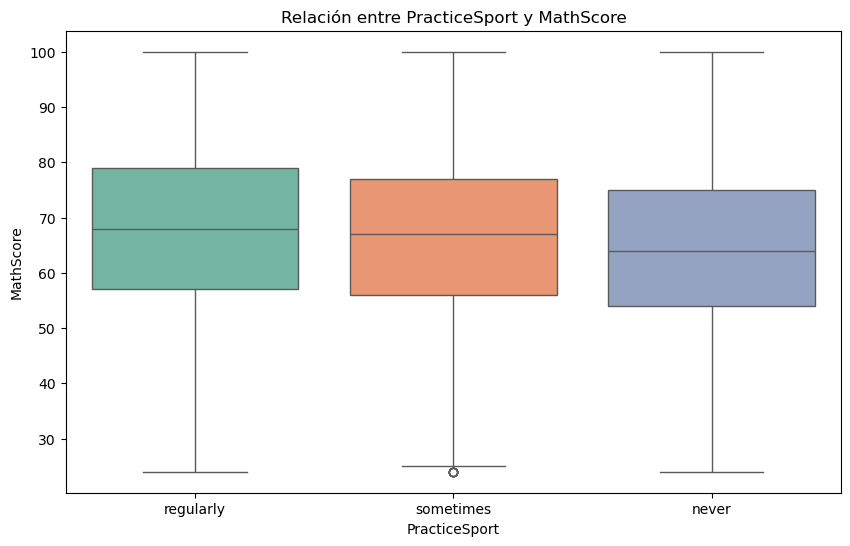

- IS FIRST CHILD

Alrededor del 65% de los estudiantes son los hijos mayores.

Tiene sentido ser el primer hijo a la hora de sacar buenas/malas notas?

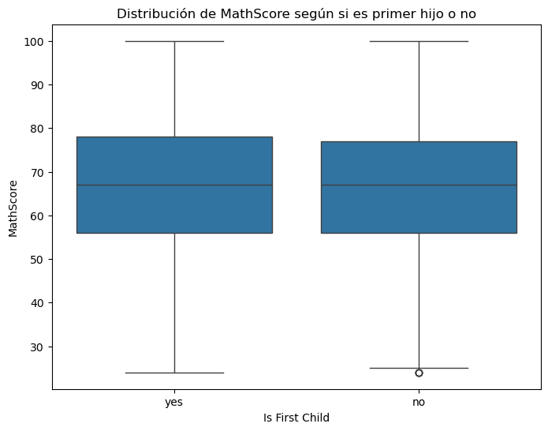

Vemos que el hecho de ser el primer hijo o el útlimo, o el del medio no afecta al rendimiento escolar.

- TRANSPORT MEANS

Tampoco el tipo de medio para llegar a la escuela (schoolbus o private) afecta a la nota del estudiante.

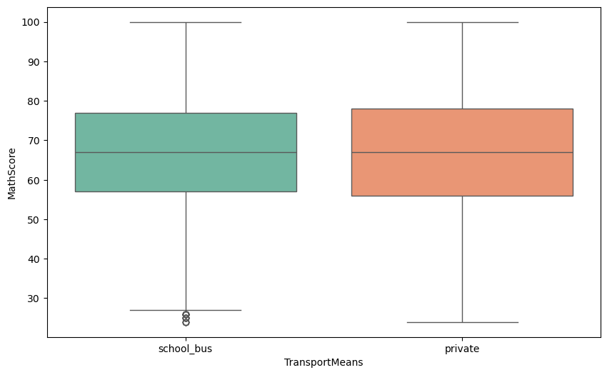

- WEEKLY STUDY HOURS

Esta feature corresponde a las horas de estudio semanales que los estudiantes han dedicado después de la escuela. 

Hay 3 valores diferentes: < 5h, entre 5 y 10 horas y más de 10 horas.

Los resultados de las puntuaciones de los tests muestran que la nota está directamente relacionada con las horas dedicadas al estudio, aunque sea de manera leve.

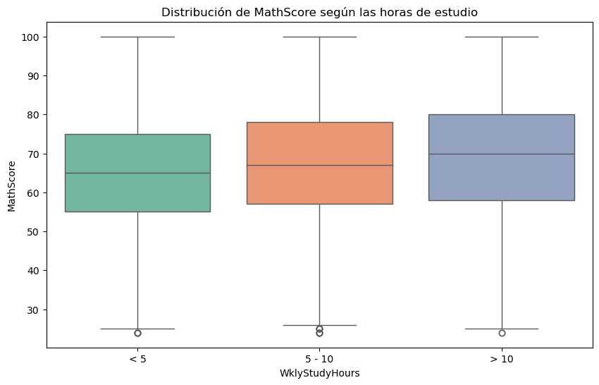

TRANSFORMAR LAS VARIABLES CATEGORICAS A NUMERICAS

- Utilizamos el LABEL ENCODING para las variables ordinales (PARENT EDUCATION, WEEKLY STUDY HOURS Y PRACTICE SPORT).

    Como no me funciona el Label Encoding (me ordena los valores en orden de aparición) voy a hacer un mapeo manual.

- ONEHOTENCODER para las variables nominales (GENDER, ETHNIC, TESP PREP ETC.)

CORRELACIONES ENTRE LAS CATEGORICAS

  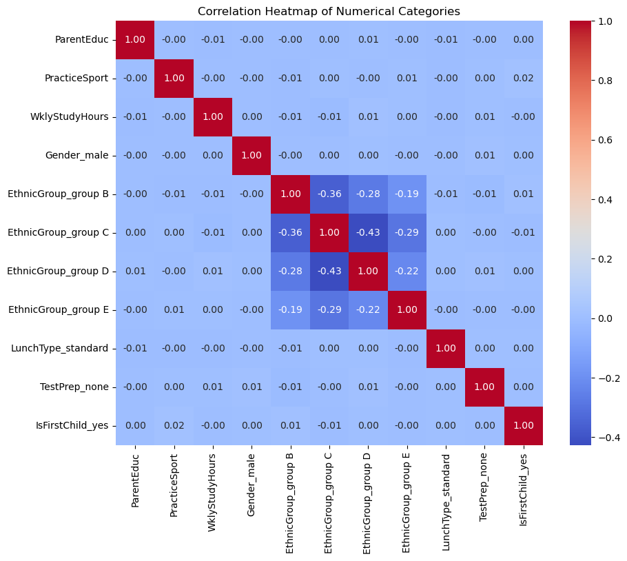
  

CORRELACIONES ENTRE LAS CATEGORICAS Y NUESTRA VARIABLE OBJETIVO MATH SCORE

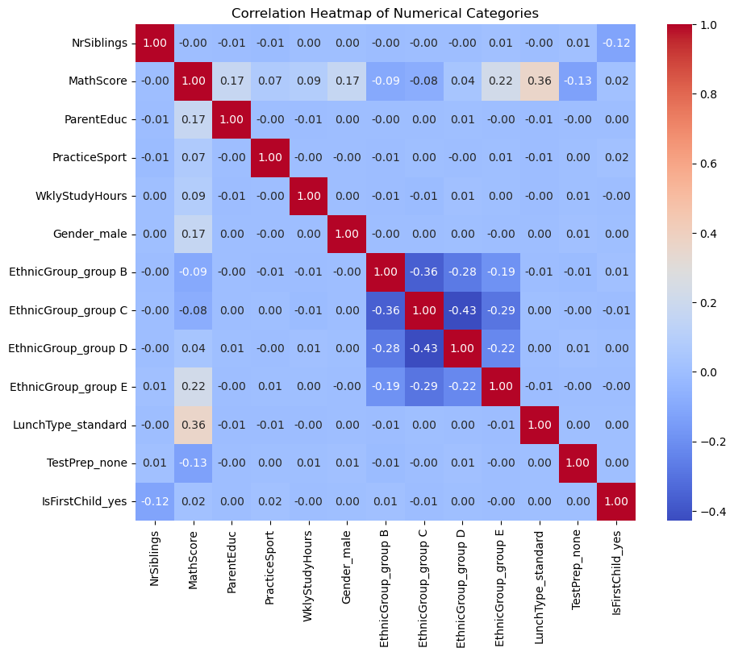

# Modelos de Machine Learning

## Opción 1: eliminando la multicolinealidad

LINEAR REGRESSION

RIDGE Y LASSO

KNN for Regression: funciona mejor con menos variables 

Así que elimino NrSiblings y FirstChild.
Tambíen cuantos más vecinos más sube el R2.

SVR (Support Vector Regression): permite más variables 

Aquí es cuando me agobié por el R2 tan bajo y finalmente decidí tratar con la multicolinealidad.

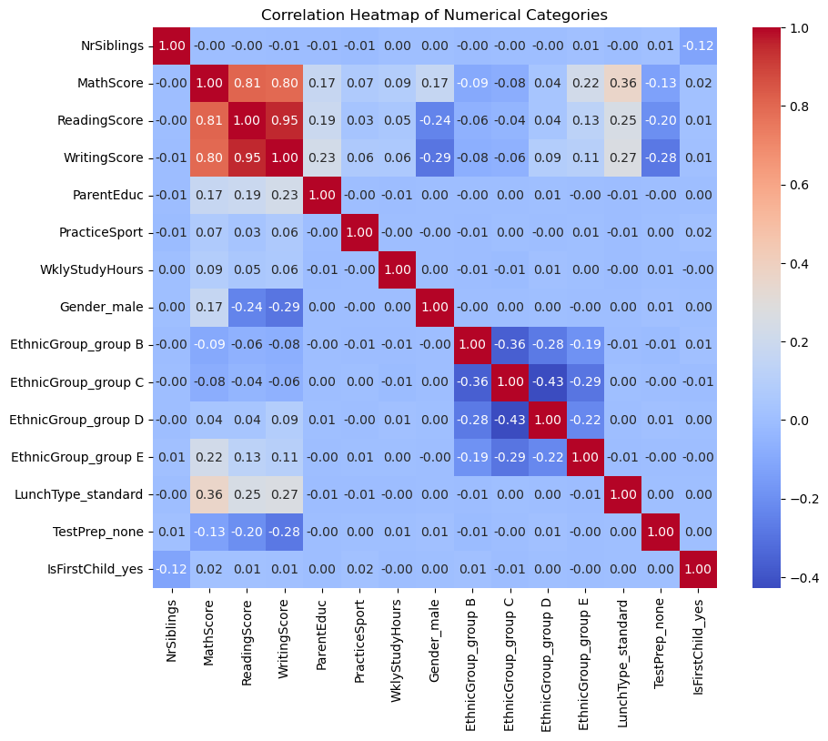

## Opción 2: tratando con la multicolinealidad
1. Me cargo solo la variable que me da el VIF más alto, por lo que me quedo con Writing Score

- OLS summary: mirar el p value, si es alto las variables no explican el modelo.

Pruebo a quitar NR OF SIBLINGS, IS FIRST CHILD Y GRUPO B porque me dan un P value muy alto:
estas variables no explican el modelo.

- Ridge y Lasso

2. Hago un promedio de las notas de Reading y Writing

- OLS summary: mirar el p value, si es alto las variables no explican el modelo

Pruebo a quitar NR OF SIBLINGS, IS FIRST CHILD Y GRUPO B porque me dan un P value muy alto:
estas variables no explican el modelo.

- Ridge y Lasso

