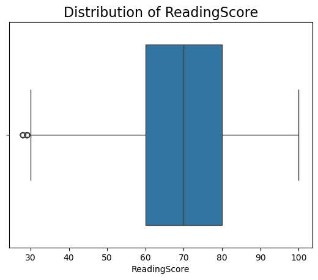
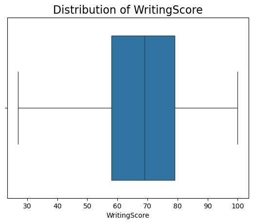
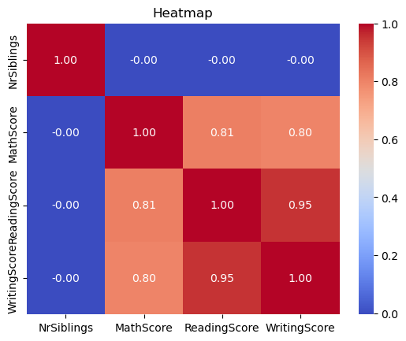
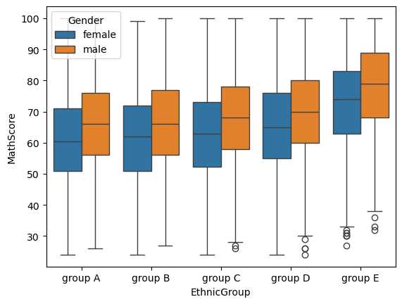
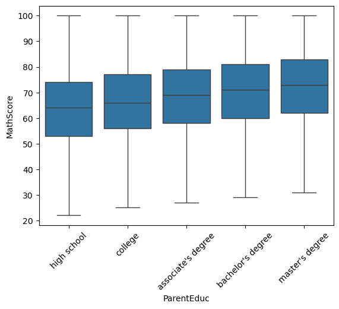
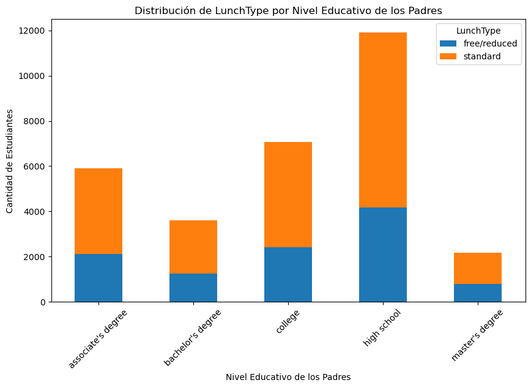
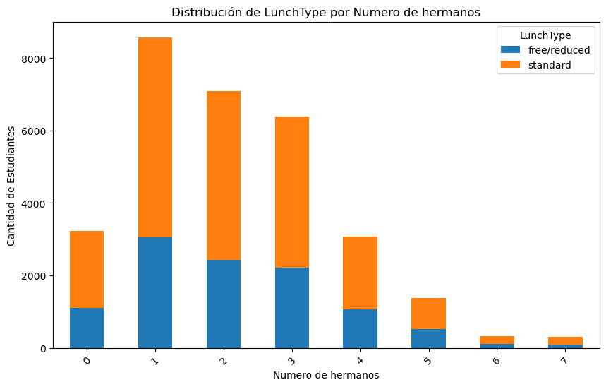
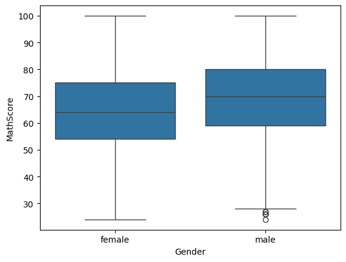

# Students Scores Analysis and Prediction
1. WEB SCRAPING

el objetivo de este proyecto incluye la aplicación tanto de web scraping como de machine learning

el primer paso ha sido encontrar una web que me permitiera contextualizar el analisis de mi base de datos, es decir, si los resultados de math score y de writing y reading score tenía algo que ver con variables como el género, la educación de los padres y la etnia de cada estudiante

WEB: https://www.bestcolleges.com/research/average-sat-score-full-statistics/#demographics

- en 2024, la nota media de Math y Reading y Writing ha sido la más baja comparada con los 6 años previos
- 2021 fue el año con la nota media más alta, tanto de Math como de Reading y Writing

ETNIA

Los estudiantes **asiaticos** son los que mejores notas en promedio han sacado, seguidos por los **blancos** y los estudiantes de **2 o más etnias**

el último grupo está formado por estudiantes **American Indian/Nativos de Alaska**, el segundo grupo con puntuaciones más bajas está constituido por los **negros**

GÉNERO

NIVEL EDUCATIVO DE LOS PADRES

2. STUDENTS PERFORMANCE ANALYSIS

Gender: género del estudiante (hombre/mujer)

EthnicGroup: grupo etnico(A, B, C, D, E)

ParentEduc: nivel de estudio de los padres

LunchType: tipo de comida (standard o free/reduced)

TestPrep: curso de preparación al test(completed or none)

ParentMaritalStatus: parent(s) marital status

PracticeSport: con qué frecuencia el estudiante practica sport

IsFirstChild: si es el primer hijo o no

NrSiblings : número de hermanos que tiene el estudiante

TransportMeans: medio de transporte al colegio

WklyStudyHours: horas de estudio semanales

MathScore: math test score

ReadingScore: reading test score

WritingScore writing test score

variables continuas VS variables categoricas

CONTINUAS (nr siblings, maths score, reading score y writing score)
- revisar duplicados
- checking null values (o cargarse las filas, reemplazar con media, intepolación)

no me gustó ninguna opción, así que opté por asignar los nulos proporcionalmente a los valores que tengo, para no distorsionar la distribución

he aplicado el interquartile methos, quedandome con los valores mayores que el lower limit

MULTICOLINEALIDAD
MATRIZ DE CORRELACIÓN

PROBAMOS CON EL VIF
Una técnica común para diagnosticar multicolinealidad es revisar el VIF (Variance Inflation Factor) de las variables. Un VIF alto indica que una variable está altamente correlacionada con otras, lo que puede ser un signo de multicolinealidad. Generalmente, un VIF mayor que 10 es un indicio de que existe multicolinealidad significativa.

CATEGORICAS 

- GENDER ANALYSIS

- ETHNIC GROUP ANALYSIS

- PARENT EDUCATIONAL BACKGROUND

- LUNCH TYPE

- TEST PREP

- PARENT MARITAL STATUS

- PRACTICE SPORT

- IS FIRST CHILD

- TRANSPORT MEANS

- WEEKLY STUDY HOURS

PASAR LAS CATEGORICAS A NUMERICAS
label encoding, onehotencoder

VER LAS CORRELACIONES

3. STUDENTS SCORES PREDICTION